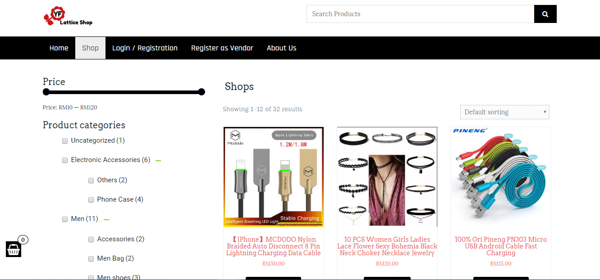

# YF Latice Shop Management System

 Final Year Project : Design and develop a web-based lattice shop mangement system

 Tools              : Wordpress 
 

This website includes three users:
1. Customer (Purchase the product)
2. Vendors (Rent and sell the product)
3. Administration (Shop owner and shop worker)

<h3>Homepage of YF Lattice Shop Management System</h3>

<h3>Shop page</h3>

<h3>Vendor Dashboard page</h3>

<footer>
  
YF Lattice Shop Management System (website): https://yflatticeshop00.000webhostapp.com/ 
</footer>
